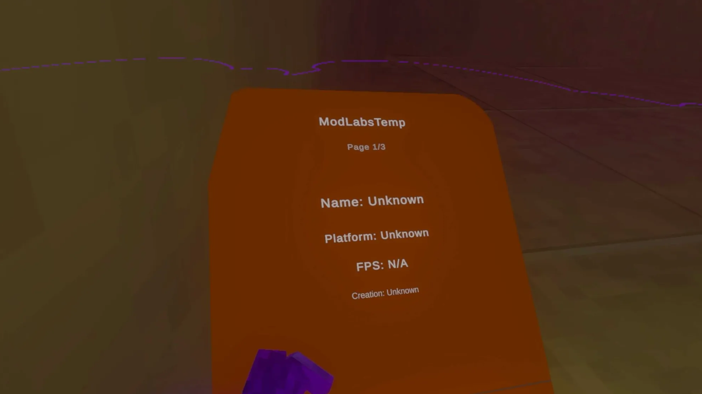

<div align="center">

# 🦍 ModLabs Mod Checker Temp

### A customizable Gorilla Tag mod-checker template built for ModLabs


<br>



<br>

**A simple starting point for creating your own Gorilla Tag mod checker.**

</div>

---

## 📖 About

**ModLabs Mod Checker Temp** is a customizable Gorilla Tag mod-checker template.

It provides a ready-made VR interface that you can modify and build upon for your own project instead of creating a checker UI completely from scratch.

The template includes player information, cosmetics, mod detection, an interactive VR menu, and several customization options.


---

## 📸 Preview

<div align="center">


*ModLabs Mod Checker Temp running in Gorilla Tag*

</div>

---

## 📥 Installation

### How to use

1. Download the .zip file
2. Extract it
3. Locate the ModLabs folder with all the scripts 
4. Shift right click in the folder click open with visual studio
5. Find ModLabsCheckerTemp/CheckerTemp.cs
6. Do CRTL + F and search for "ModLabsTemp"
7. Change everything thats highlighted to your checker name
8. Thats it have fun!

```text
Gorilla Tag/BepInEx/plugins/
